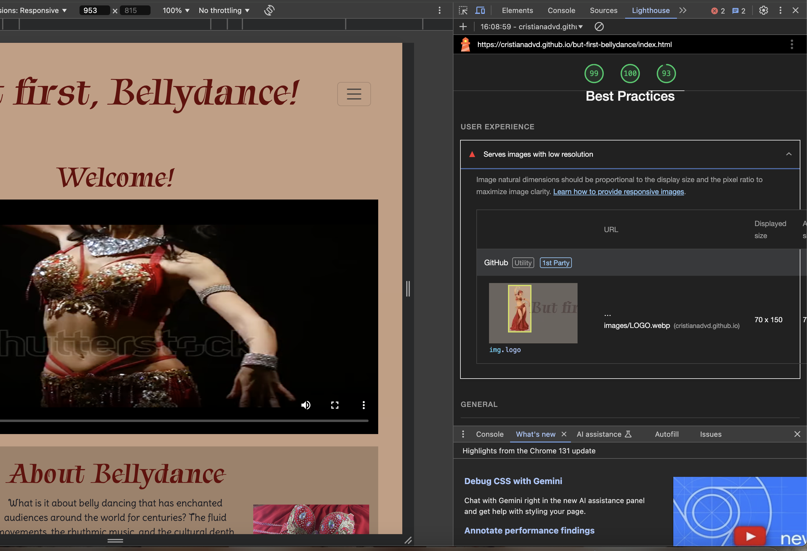
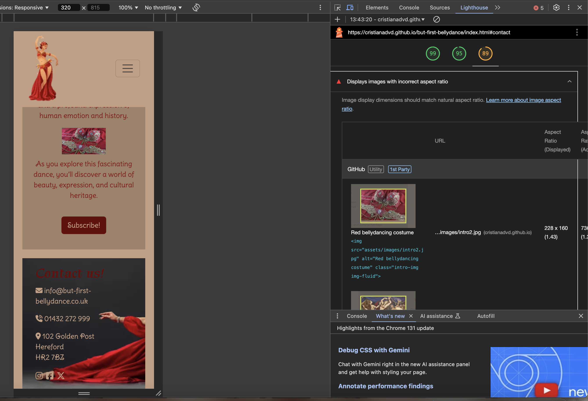
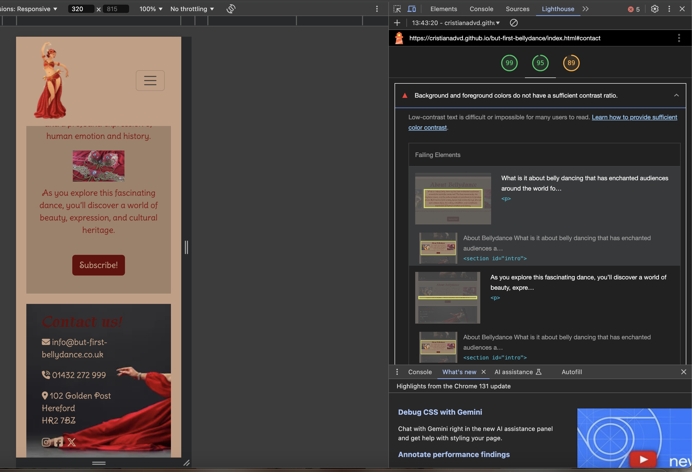
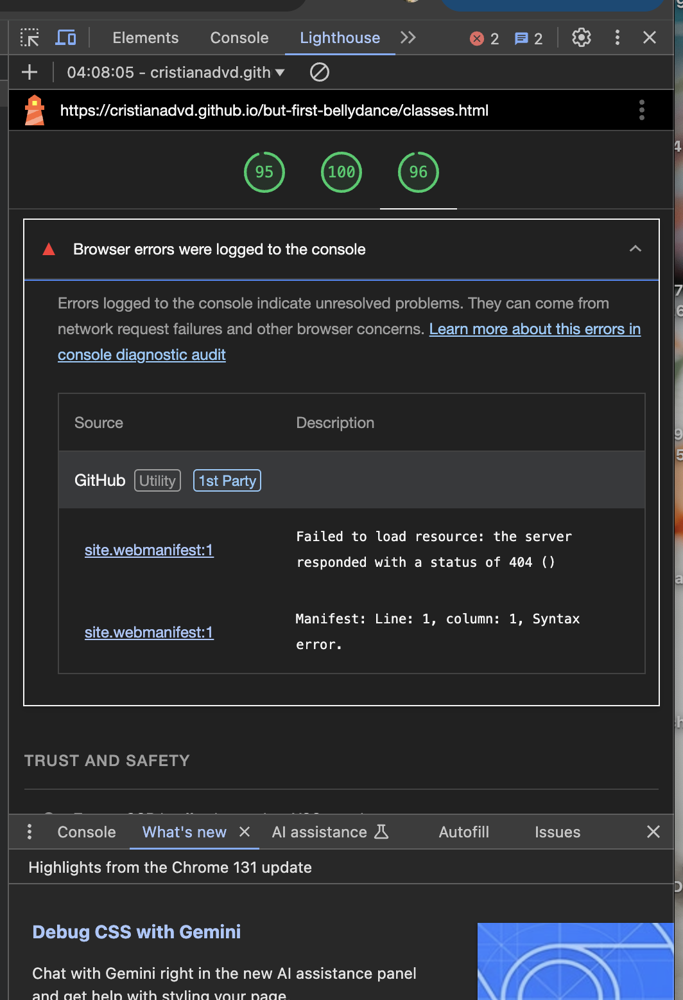
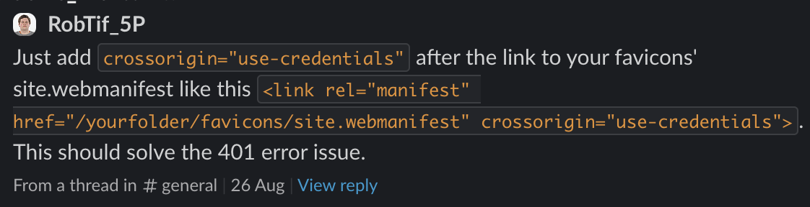
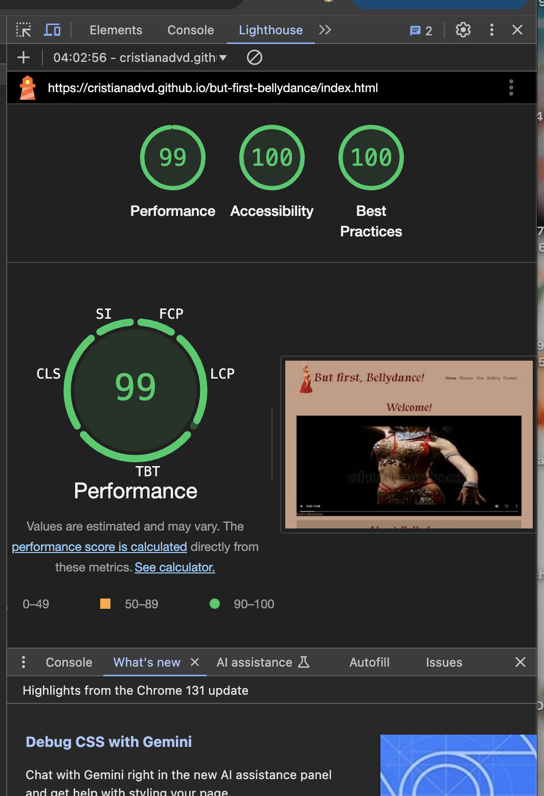
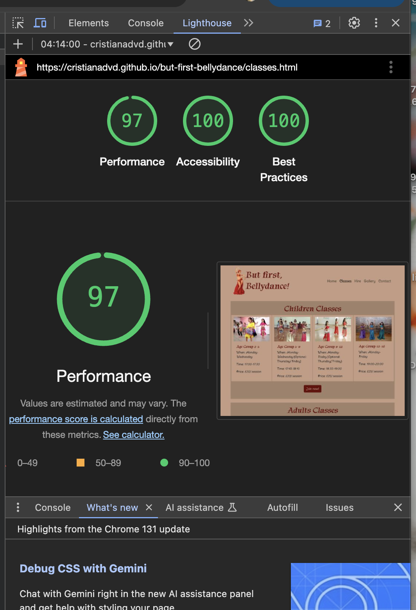
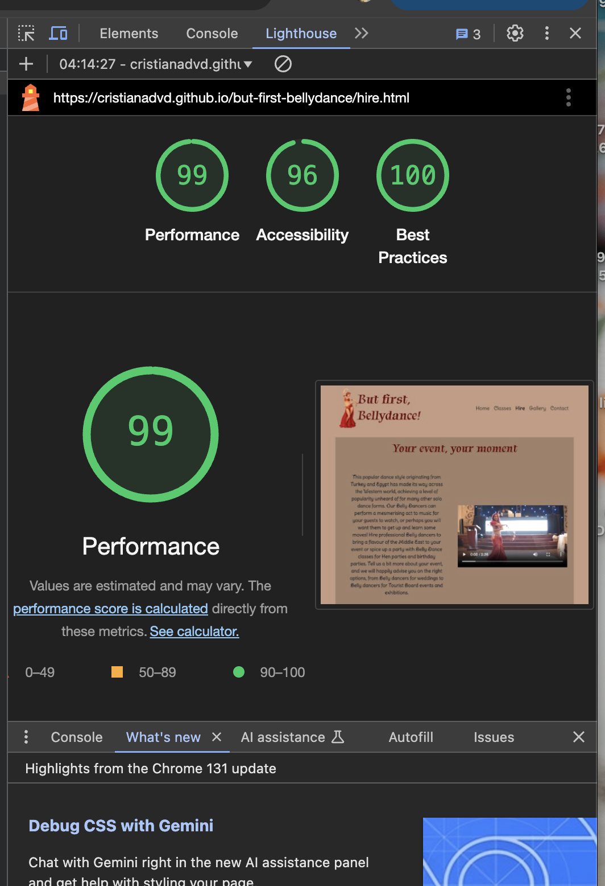
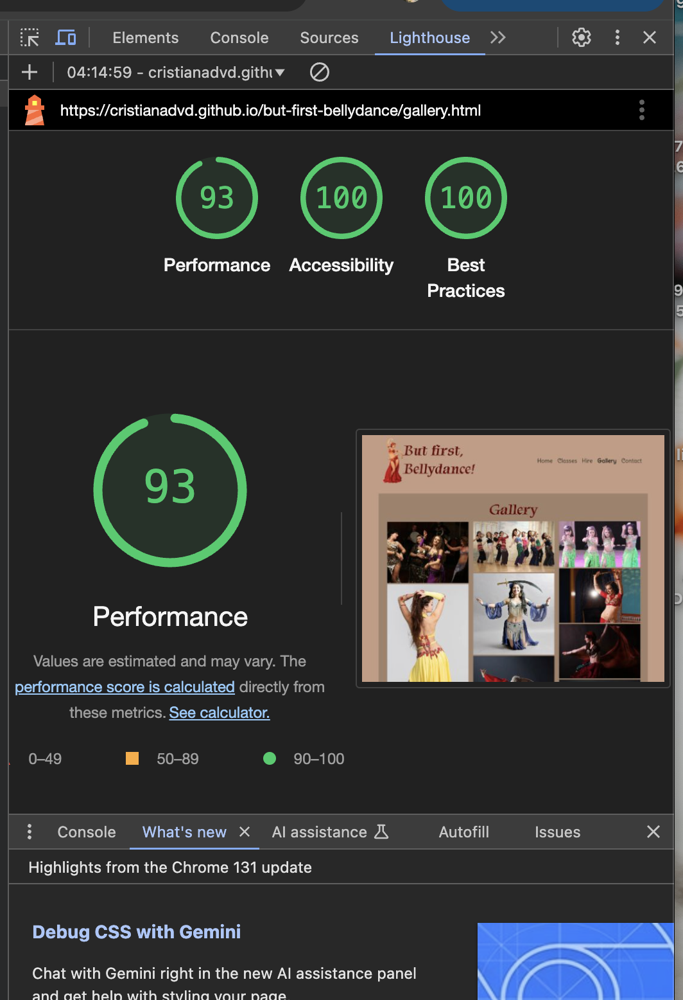
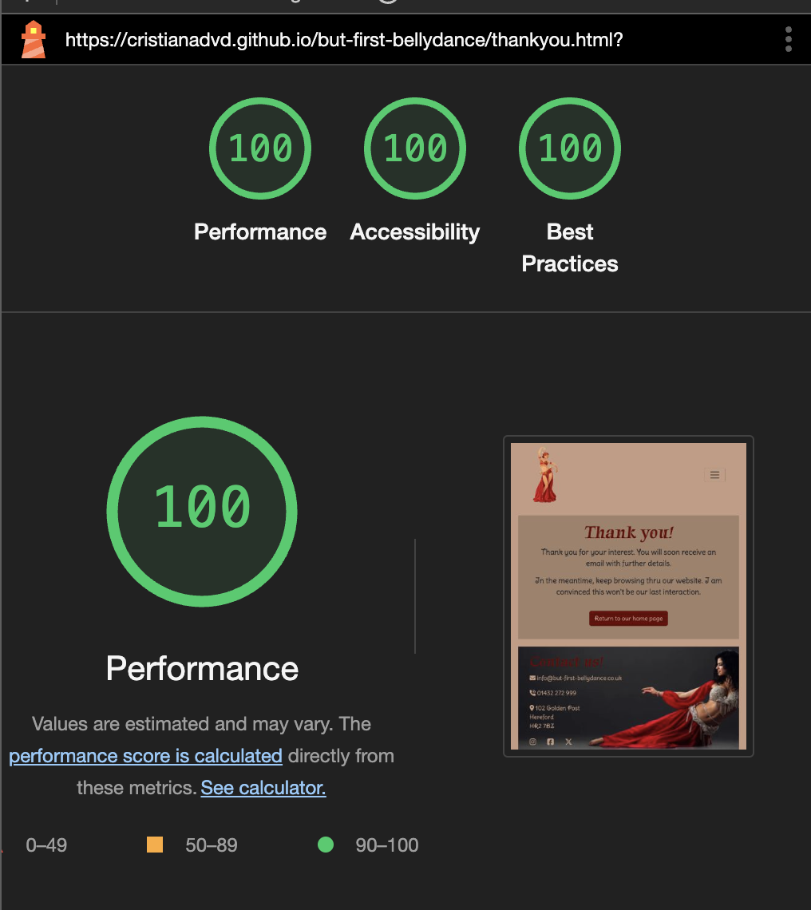

# But first, Bellydance!

The But first, Bellydance! website was created to be responsive, permitting all its visitors to have a good User Experience on different screen-size devices.

## [View But first, Bellydance! website on Github pages](https://cristianadvd.github.io/but-first-bellydance/)

## Contents
* [User Experience](#user-experience)
  * [External user's goals](#external-users-goals)

* [Design](#design)
  * [Colour Scheme](#colour-scheme)
  * [Typography](#typography)
  * [Imagery](#imagery)
  
* [Features](#Features)
  * [Navigation bar](#navigation-bar)
  * [Home page](#home-page)
  * [Footer/ Contact page](#footer-contact-section)
  * [Classes page](#classes-page)
  * [Hire page](#hire-page)
  * [Gallery page](#gallery-page)
  * [Thank you page](#thank-you-page)
  * [404 page](#404-page)
  * [Features to be implemented](#features-to-be-implemented)

* [Accessibility](#Accessibility)

* [Languages Used](#languages-used)
  * [Frameworks, Libraries & Programs Used](#frameworks-libraries--programs-used)

* [Deployment & Local Development](#Deployment-&-Local-Development)
  * [Deployment](#Deployment)

* [Testing](#testing)
  * [Solved bugs](#solved-bugs)
  * [Lighthouse](#lighthouse)
  * [Full testing](#full-testing)

* [Credits](#credits)  
---

## User Experience

The But first, Bellydance! website welcomes all visitors that want to find out about belly dance classes for everyone over 2 years old, with different options for children and adults. Also, all visitors can access the Hire page to transform any event into a unique one. The goal of the site is to offer a different entertainment environment.

### External user's goals.

- The site's users are interested in finding the most appropriate class option by age, when it takes place and price for all.
- The users are looking for a hire enquiry form to have a bellydancer at their event.
- The users are expecting to find a gallery with high quality pictures.
- The users are looking to find contact information easily.

## Design

### Colour Scheme

The website uses a colour palette to match with the majority of images used. The colour palette was created using the [Coolors](https://coolors.co/) website.

### Typography

- Google Fonts was used for the following fonts:

  - Tapestry font was used for headings. It is a serif font.
  - Delius Swash Caps font was used for the body text on the site. It is a sans-serif font.

### Imagery

All images used for the website are credited in the [credits](#Credits) section.

## Features

The website is comprised of six pages, four of them being accessible from the navigation bar (home page, classes, hire, gallery), the fifth which is a thank you page that opens when all three forms of the website (subscription, join now for classes and hire form) are submitted, and sixth which is a 404 page in case something doesn't go as desired.

_Initially, website pages were structured in sections with divs of a container each. After reviewing website across very large screen devices, decided to leave only the headings into a container and write the body of the sections in rows for a better user experience on very large screens. (This change can be seen in the commits)_

### Navigation bar

- All pages of the website display a responsive navigation bar at the top which allows the user to navigate through the site. To the left of the navigation bar is an image of bellydancer ilustration logo together with the text But first, Bellydance!. To the right of the navigation bar are the links to the websites pages (home, classes, hire, gallery, contact) visible and easily accessible.
  

- To allow a good user experience of the site, the But first, Bellydance! text is hidden with a media query on mobile devices to prevent the navigation bar looking cluttered. When viewing with mobile devices the navigation links change to a burger toggler. This was implemented to give the site a clean look and to promote a good user experience, as users are used to seeing the burger icon when on mobile devices to navigate a site.

  

### Home page

- Structured in 2 sections the home page welcomes all users with a slow motion presentation video. It allows the user to play it or not, or to pause it.
  Credits for this video are presented in the [credits](#Credits) section, as well as on the bottom left corner of the video in small writing.

  

- Second section presents a small introduction to what belly dance means. Text taken from [Cazbar website](https://www.cazbar.com/blog/origins-history-of-belly-dancing/)

  - It provides a short invitation for the user to browse thru the other pages to find out what is offering.
  - Two images, an illustration and a belly dance costume provides a even better experience for the user website.
  - Here the user can find a subscribe button, if interested about new features of the website.

  

- Modal (subscription)

  - After pressing the button Subscribe, a modal opens up in the home page where the users can write their email and name. Both inputs are required in order to submit.

  

### Footer/ Contact section

- All website pages incorporate a footer with contact info for the website, using icons as these are universally recognized

  - Footer presents contact information such as email, telephone number and address, on a background image of a bellydancer.
  - Social links can be find at the bottom of the footer, all opening in new tabs.

  

### Classes page

- Classes page structured on 2 sections:

  - Children classes section displays 4 cards with code used from Bootstrap and styled in CSS, providing information to users about when each age group class is taken place. Prices also displayed at the bottom of each card.
  - A Join now button can be find at the bottom of the section, for all users interested in getting their children to bellydance classes.

  

  - Adults classes section displays 4 cards with code used from Bootstrap and styled in CSS, providing information to users about when each category of classes is taken place. Prices also displayed at the bottom of each card.
  - A Join now button can be find at the bottom of the section, for all users interested to join a bellydance class.

  

  - A modal opens up after users are using the join now button. It displays a radio check form, and a form with required inputs for email address, name, age, class options to choose from, and an optional textarea for additional details.

  

### Hire page

- A hire event page broken into 2 sections:

  - Event section with heading "Your event, your moment" which tells the users why are they on this page.
  - A presentation text taken over from [Hire a Bellydancer website](https://hire-a-dancer.com/acts/p/belly-dancers)
  - A presentation video of a bellydancer providing a dance moment with fire element, convincing the users to fill out the following hire form on the website. (Merits acknowledged in the [credits](#Credits) section.)

  

  - Hire form section. Form written with code used from Bootstrap, modified in HTML and also styled in CSS to fit with the content of the website. This displays required inputs as well as an optional textarea for additional details.

  

### Gallery page

Users can easily find and acces a fully responsive gallery page, displaying high quality images from belly dance classes, event-shows or presentation photos. Credit given to all websites in the [credits](#Credits) section.

### Thank you page

When all three buttons present in the website (subscribe, join now, submit from hire form) are correctly submitted, these lead to a thank you page, that displays same navigation bar and footer as per website design and a short text. It also contains a Return to home page button for a better UX.

### 404 page

Owner also created a 404 Error page displaying same navigation bar and footer as the website, to save the user from searching for our website from scratch. (Created after my mentor's suggestion @G-Taylor)

### Features to be implemented

- Parental permission in writting for children to join classes.
- Free entry events for whoever can't afford to join classes.

## Accessibility

Throughout the development process, I took care to make the website as accessible as feasible. I've done this by:

- Using descriptive alt attributes on images on the site.
- Making sure that the site has a enough color contrast.
- Ensuring menus are accessible by marking the current page as current for screen readers.
- Giving screen reader information in cases when icons are used instead of text

---

## Languages Used

This website was made with HTML and CSS.

### Frameworks, Libraries & Programs Used

Git - For version control.

Github - To save and store the files for the website.

Bootstrap Version 4.5 - The framework for the website. Code for the navigation bar, footer, cards and forms were used and modified. Additional CSS styling was also implemented in style.css.

Google Fonts - To import the fonts used on the website.

Font Awesome - For the iconography on the website.

Google Dev Tools - To troubleshoot and test features, solve issues with responsiveness and styling.

[Favicon.io](https://favicon.io/) To create favicon.

[Am I Responsive?](http://ami.responsivedesign.is/) To show the website image on a range of devices.

---

## Deployment

Github Pages was used to deploy the live website. The instructions to achieve this are below:

1. Log in (or sign up) to Github.
2. Find the repository for this project, But first, Bellydance!.
3. Click on the Settings link.
4. Click on the Pages link in the left hand side navigation bar.
5. In the Source section, choose main from the drop down select branch menu. Select Root from the drop down select folder menu.
6. Click Save. Your live Github Pages site is now deployed at the URL shown.

## Testing

Testing kept going throughout every stage of the development. As I went along developing, I used the Chrome developer tools to identify and fix any problems.

### Solved bugs

- Buttons were not centered. Googled code to center Subscribe button and used for the other buttons of the website.

- Some images in gallery were squeezing on larger devices. Added width and height to images in CSS to fix the issue.

- Removed autoplay attribute from video as added standard by bootstrap code. Added controls instead for better UX.

- Navigation menu was not displayed under the logo image. This was caused due to cancelling wrap rule as wanted to display all, logo, title and burger icon on small devices. Deleted style rule applied previously and decided to hide title page on small devices.

- Text would not center in 404 page. This was due to missing the line between text and center words. Issue fixed.

- Removed container class from div embedding body on all sections. This made the website responsive on xxl screens.

### Lighthouse

I used Lighthouse within the Chrome Developer Tools to allow me to test the performance, accessibility and best practices of the website.

- Initial lighthouse testing :

1. Serve images in next-gen formats. Lighthouse suggests using image formats such as WebP & AVIF to improve compression and lead to faster downloads and less data consumption. I have now converted the logo and all images to webp format using [Online-convertor](https://image.online-convert.com/)

2. Background and foreground colors do not have a sufficient contrast ratio. I have now changed body text and card text to a the darker colour from the colour palette used.

3. Browser errors were logged to the console. Href for manifest link didn't have the correct path. Issue was not solved after implementing the correct path. Slack search found a code solution as seen in the below image. Issue now solved.
   

- Final Lighthouse testing:

### Full testing

I went through each page using google chrome developer tools to ensure that they responsive on all different screen sizes.

Links.

1. Test each link on the home page. Each link worked as expected, and any links leading to external pages opened correctly in a seperate browser tab.
2. Test each link on the classes page. Each link worked as expected, and any links leading to external pages opened correctly in a seperate browser tab.
3. Test each link on the hire page. Each link worked as expected, and any links leading to external pages opened correctly in a seperate browser tab.
4. Test each link on the gallery page. Each link worked as expected, and any links leading to external pages opened correctly in a seperate browser tab.
5. Test each link on the thank you page. Each link worked as expected, and any links leading to external pages opened correctly in a seperate browser tab.
6. Test each link on the 404 page. Each link worked as expected, and any links leading to external pages opened correctly in a seperate tab.

Join now Form.

- Tested the join now form. I tried to submit the form without filling in any input fields. The form worked correctly and directed users to fill in the name field. I then filled in the name field and tried to submit the form. Again the form worked correctly and directed the user to fill out the email field. I filled out the name and email forms and tried to submit the form. The form worked correctly and asked the user to fill in the age field. I filled out the name, email and age field and tried to submit the form. The form worked correctly and asked the user to choose the correct class selection field. I filled out the name, email, age field and selected a category of classes and tried to submit the form. The form then opens the thank you page in the same browser window.

Subscribe form.

- Tested the subscribe form. I tried to submit the form without filling in any input fields. The form worked correctly and directed users to fill in the name field. I then filled in the name field and tried to submit the form. Again the form worked correctly and directed the user to fill out the email field. I filled out the name and email forms and tried to submit the form. The form then opens the thank you page in the same browser window.

Hire form

- Tested the hire form. I tried to submit the form without filling in any input fields. The form worked correctly and directed users to fill in the name field. I then filled in the name field and tried to submit the form. Again the form worked correctly and directed the user to fill out the email field. I filled out the name and email forms and tried to submit the form. The form worked correctly and asked the user to fill in the thelephone number field. I filled out the name, email and phone field and tried to submit the form. The form worked correctly and asked the user to choose the correct event type selection field. I filled out the name, email, phone number field and selected an event and tried to submit the form. The form worked correctly and asked the user to choose the required date field. I filled out the name, email, phone number field and selected an event and date required and tried to submit the form. The form then opens the thank you page in the same browser window.

## Credits

- [Kera Cudmore](https://github.com/kera-cudmore) For readme.md writing.
- [Boardwalk games project on LMS](https://github.com/CristianaDvD/boardwalk-games) For base of the html doc. Modified afterwards.
- [Logo image](https://i.pinimg.com/236x/f6/03/b1/f603b15b7cb875f52c857afbb6f4ba92.jpg)
- [Video on home page](https://www.shutterstock.com/ro/video/clip-1026164903-girl-performs-belly-dance-oriental-costume-black)
- [Intro text on home page](https://www.cazbar.com/blog/origins-history-of-belly-dancing/)
- [Illustration image on home page](https://5thelement.co.nz/wp-content/uploads/2008/05/bellydancers.jpg)
- [Red costume photo on home page](https://i.pinimg.com/736x/96/87/d7/9687d71b305ebf2d4bf17643b423d1e8.jpg)
- [Contact background image](https://5thelement.co.nz/wp-content/uploads/2008/05/bellydancers.jpg)
- [Text on hire page](https://hire-a-dancer.com/acts/p/belly-dancers)
- [Video on hire page](https://www.pexels.com/video/a-woman-doing-belly-dancing-4477920/)

Links to images used for Classes page:
- https://5thelement.co.nz/wp-content/uploads/2008/05/bellydancers.jpg
- https://5thelement.co.nz/wp-content/uploads/2008/05/bellydancers.jpg
- https://www.hasinabellydance.com/wp-content/uploads/2015/06/hasina-bellydance-london-1305x430.jpg
- https://www.hasinabellydance.com/wp-content/uploads/2015/06/hasina-bellydance-london-1305x430.jpg
- https://www.facebook.com/photo/?fbid=374498651538700&set=a.374498614872037 
- https://www.google.com/url?sa=i&url=https%3A%2F%2Fwww.youtube.com%2Fplaylist%3Flist%3DPLJC5jGNeB-hq3qSphMQUS_XK9pMHgi_l4&psig=AOvVaw3VN766KdWxBJPFnger9byX&ust=1733948643468000&source=images&cd=vfe&opi=89978449&ved=0CBQQjRxqFwoTCOiuj52EnooDFQAAAAAdAAAAABBI
- https://www.bellysister.com/wp-content/uploads/2020/08/BELLYDANCE-KID.jpg
- https://i.ytimg.com/vi/kiqkT6owOUI/maxresdefault.jpg

Gallery images used from:
- https://labellydanceacademy.com/wp-content/uploads/2020/06/in-studio-shot.jpg
- https://www.hasinabellydance.com/wp-content/uploads/2015/06/hasina-bellydance-london-1305x430.jpg
- https://www.hasinabellydance.com/wp-content/uploads/2015/06/hasina-bellydance-london-1305x430.jpg
- https://www.shutterstock.com/ro/image-photo/young-dancer-long-hair-oriental-costume-2182358155/edit?tool=bgremover&chatId=afe6a0ac44c34660ab06c3781df1c5d6	
- https://i.ebayimg.com/images/g/vAQAAOSwtJZXVAdu/s-l1200.jpg
- https://i.guim.co.uk/img/media/206e9171bcf70420c3bdf717ebc2be9ea0d52e8a/534_231_4340_2602/master/4340.jpg?width=1200&height=900&quality=85&auto=format&fit=crop&s=6cd3104f4d826a3f533e3112d1a9e70a
- https://www.cazbar.com/wp-content/uploads/2024/06/belly-dancing.png
- https://www.google.com/url?sa=i&url=https%3A%2F%2Fwww.timeoutabudhabi.com%2Fkids%2Fbumps-babies%2Ffitness%2F52288-belly-dancing-lessons-in-abu-dhabi&psig=AOvVaw0LFRQsdQEKy_DUPvvha7go&ust=1734033559576000&source=images&cd=vfe&opi=89978449&ved=0CBQQjRxqFwoTCPj8rcfAoIoDFQAAAAAdAAAAABAk
- https://i.ytimg.com/vi/O8fDQrDvyYU/maxresdefault.jpg

