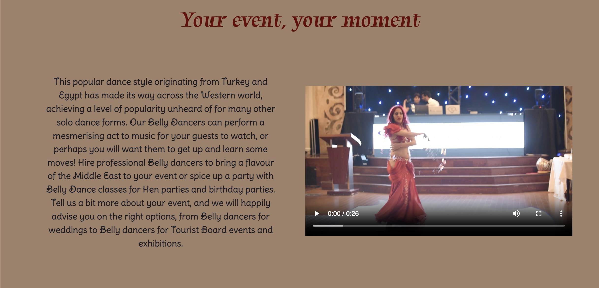

# But first, Bellydance!

The But first, Bellydance! website was created to be responsive, permitting all its visitors to have a good User Experience on different screen-size devices.

## [View But first, Bellydance! website on Github pages](https://cristianadvd.github.io/but-first-bellydance/)

## Contents

---

## User Experience

The But first, Bellydance! website welcomes all visitors that want to find out about belly dance classes for everyone over 2 years old, with different options for children and adults. Also, all visitors can access the Hire page to transform any event into a unique one. The goal of the site is to offer a different entertainment environment.

### External user's goals.

- The site's users are interested in finding the most appropriate class option by age, when it takes place and price for all.
- The users are looking for a hire enquiry form to have a bellydancer at their event.
- The users are expecting to find a gallery with high quality pictures.
- The users are looking to find contact information easily.

## Design

### Colour Scheme

The website uses a colour palette to match with the majority of images used. The colour palette was created using the [Coolors](https://coolors.co/) website.

### Typography

- Google Fonts was used for the following fonts:

  - Tapestry font was used for headings. It is a serif font.
  - Delius Swash Caps font was used for the body text on the site. It is a sans-serif font.

### Imagery

All images used for the website are credited in the [credits](#Credits) section.

## Features

The website is comprised of six pages, four of them being accessible from the navigation bar (home page, classes, hire, gallery), the fifth which is a thank you page that opens when all three forms of the website (subscription, join now for classes and hire form) are submitted, and sixth which is a 404 page in case something doesn't go as desired.

_Initially, website pages were structured in sections with divs of a container each. After reviewing website across very large screen devices, decided to leave only the headings into a container and write the body of the sections in rows for a better user experience on very large screens. (This change can be seen in the commits)_

### Navigation bar

- All pages of the website display a responsive navigation bar at the top which allows the user to navigate through the site. To the left of the navigation bar is an image of bellydancer ilustration logo together with the text But first, Bellydance!. To the right of the navigation bar are the links to the websites pages (home, classes, hire, gallery, contact) visible and easily accessible.
  

- To allow a good user experience of the site, the But first, Bellydance! text is hidden with a media query on mobile devices to prevent the navigation bar looking cluttered. When viewing with mobile devices the navigation links change to a burger toggler. This was implemented to give the site a clean look and to promote a good user experience, as users are used to seeing the burger icon when on mobile devices to navigate a site.

  

### Home page

- Structured in 2 sections the home page welcomes all users with a slow motion presentation video. It allows the user to play it or not, or to pause it.
  Credits for this video are presented in the [credits](#Credits) section, as well as on the bottom left corner of the video in small writing.

  

- Second section presents a small introduction to what belly dance means. Text taken from [Cazbar website](https://www.cazbar.com/blog/origins-history-of-belly-dancing/)

  - It provides a short invitation for the user to browse thru the other pages to find out what is offering.
  - Two images, an illustration and a belly dance costume provides a even better experience for the user website.
  - Here the user can find a subscribe button, if interested about new features of the website.

  

- Modal (subscription)

  - After pressing the button Subscribe, a modal opens up in the home page where the users can write their email and name. Both inputs are required in order to submit.

  

### Footer/ Contact section

- All website pages incorporate a footer with contact info for the website, using icons as these are universally recognized

  - Footer presents contact information such as email, telephone number and address, on a background image of a bellydancer.
  - Social links can be find at the bottom of the footer, all opening in new tabs.

  

### Classes page

- Classes page structured on 2 sections:

  - Children classes section displays 4 cards with code used from Bootstrap and styled in CSS, providing information to users about when each age group class is taken place. Prices also displayed at the bottom of each card.
  - A Join now button can be find at the bottom of the section, for all users interested in getting their children to bellydance classes.

  

  - Adults classes section displays 4 cards with code used from Bootstrap and styled in CSS, providing information to users about when each category of classes is taken place. Prices also displayed at the bottom of each card.
  - A Join now button can be find at the bottom of the section, for all users interested to join a bellydance class.

  

  - A modal opens up after users are using the join now button. It displays a radio check form, and a form with required inputs for email address, name, age, class options to choose from, and an optional textarea for additional details.

  

### Hire page

- A hire event page broken into 2 sections:

  - Event section with heading "Your event, your moment" which tells the users why are they on this page.
  - A presentation text taken over from [Hire a Bellydancer website](https://hire-a-dancer.com/acts/p/belly-dancers)
  - A presentation video of a bellydancer providing a dance moment with fire element, convincing the users to fill out the following hire form on the website. (Merits acknowledged in the [credits](#Credits) section.)

  

  - Hire form section. Form written with code used from Bootstrap, modified in HTML and also styled in CSS to fit with the content of the website. This displays required inputs as well as an optional textarea for additional details.

  

### Gallery page

Users can easily find and acces a fully responsive gallery page, displaying high quality images from belly dance classes, event-shows or presentation photos. Credit given to all websites in the [credits](#Credits) section.

  

### Thank you page 

When all three buttons present in the website (subscribe, join now, submit from hire form) are correctly submitted, these lead to a thank you page, that displays same navigation bar and footer as per website design and a short text. It also contains a Return to home page button for a better UX.

  

### 404 page

Owner also created a 404 Error page displaying same navigation bar and footer as the website, to save the user from searching for our website from scratch. (Created after my mentor's suggestion @G-Taylor)

   

### Features to be implemented 

- Parental permission in writting for children to join classes.
- Free entry events for whoever can't afford to join classes.

## Accessibility 

Throughout the development process, I took care to make the website as accessible as feasible. I've done this by:

   - Using descriptive alt attributes on images on the site.
   - Making sure that the site has a enough color contrast.
   - Ensuring menus are accessible by marking the current page as current for screen readers.
   - Giving screen reader information in cases when icons are used instead of text 